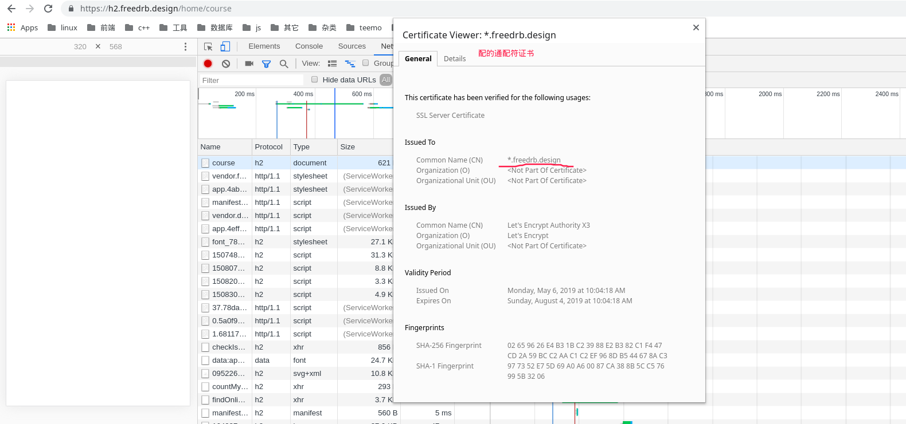
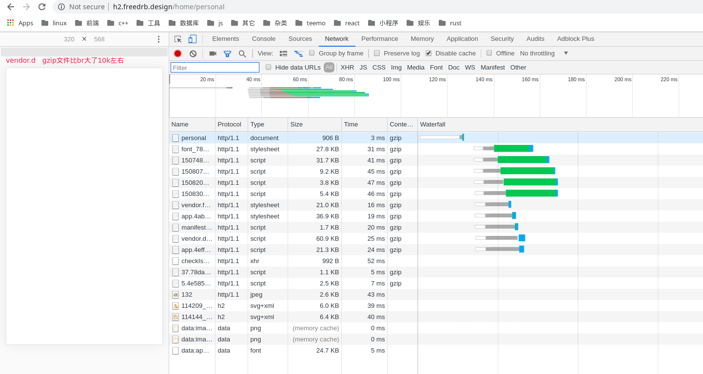
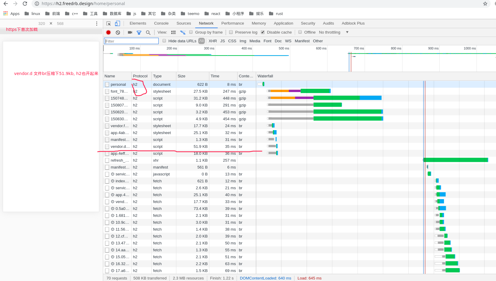
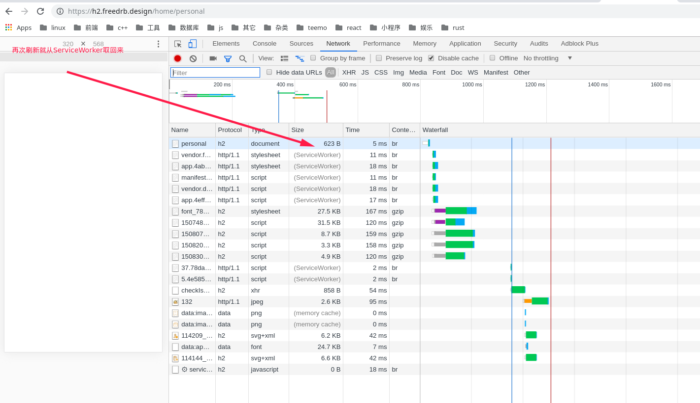

### 申请https通配符证书
选择[lets-encrypt](https://certbot.eff.org/lets-encrypt/arch-nginx)来获取免费的https证书，先安装nginx certbot
> yaourt -Ss nginx certbot certbot-nginx

这里我选最简单的一种方式，手动dns认证
>
    #sudo certbot certonly  -d "*.freedrb.design" -d freedrb.design --manual --preferred-challenges dns --server https://acme-v02.api.letsencrypt.org/directory


    Are you OK with your IP being logged?
    - - - - - - - - - - - - - - - - - - - - - - - - - - - - - - - - - - - - - - - -
    (Y)es/(N)o: y

    - - - - - - - - - - - - - - - - - - - - - - - - - - - - - - - - - - - - - - - -
    Please deploy a DNS TXT record under the name
    _acme-challenge.freeddrb.cn with the following value:


    Before continuing, verify the record is deployed.
    - - - - - - - - - - - - - - - - - - - - - - - - - - - - - - - - - - - - - - - -
    Press Enter to Continue

先按Y 随后跟着到域名提供商添加一天记录（如阿里的云dns解析的地方到该域名里添加一条TXT 值为`FVnsn0NSsCehhOl2RC1Cwt3aDzho89cP4_NlakDKrMs`[它给的值]的`_acme-challenge.freeddrb.cn`记录）

自动续签证书　　没试过　当时没过期　等过期了　试一下　具体可以参考下[archwiki](https://wiki.archlinux.org/index.php/Certbot#Automatic_renewal)


### 前端nginx的部署
先来看下相应的配置
> 
    # tree -L 2 /etc/nginx/
    /etc/nginx/　配置目录
    ├── brotli.conf　// brotli压缩相关的开启
    ├── conf  // 对应server的配置目录，一个文件对应一个server块
    │   ├── default.conf
    │   ├── test1.conf
    │   └── test.conf
    ├── fastcgi.conf
    ├── fastcgi_params
    ├── gzip.conf　// 
    ├── koi-utf
    ├── koi-win
    ├── mime.types
    ├── nginx.conf //nginx配置文件　在此导入相关的配置
    ├── nginx.conf.back
    ├── scgi_params
    ├── ssl.conf
    ├── uwsgi_params
    └── win-utf

    1 directory, 16 files


其中 ssl.conf 如下
>
    listen 443 ssl http2;
    ssl_certificate /etc/letsencrypt/live/freedrb.design/fullchain.pem;
    ssl_certificate_key /etc/letsencrypt/live/freedrb.design/privkey.pem;
    ssl_session_cache shared:le_nginx_SSL:1m;
    ssl_session_timeout 1440m;

    ssl_protocols TLSv1 TLSv1.1 TLSv1.2;
    ssl_prefer_server_ciphers on;

    ssl_ciphers "ECDHE-ECDSA-AES128-GCM-SHA256 ECDHE-ECDSA-AES256-GCM-SHA384 ECDHE-ECDSA-AES128-SHA ECDHE-ECDSA-AES256-SHA ECDHE-ECDSA-AES128-SHA256 ECDHE-ECDSA-AES256-SHA384 ECDHE-RSA-AES128-GCM-SHA256 ECDHE-RSA-AES256-GCM-SHA384 ECDHE-RSA-AES128-SHA ECDHE-RSA-AES128-SHA256 ECDHE-RSA-AES256-SHA384 DHE-RSA-AES128-GCM-SHA256 DHE-RSA-AES256-GCM-SHA384 DHE-RSA-AES128-SHA DHE-RSA-AES256-SHA DHE-RSA-AES128-SHA256 DHE-RSA-AES256-SHA256 EDH-RSA-DES-CBC3-SHA";
    # if ($scheme != "https") {
    #    return 301 https://$host$request_uri;
    # }


gzip.conf 内容如下:
>
    #gzip
    gzip on;
    gzip_static on;
    gzip_min_length 1k;
    gzip_http_version 1.1;
    gzip_comp_level 9;
    gzip_types  text/plain text/css application/javascript application/json image/svg+xml application/xml+rss;


brotli.conf 内容如下
>
    #brotli
    brotli on;
    brotli_static on;        # for static compression, explained later
    brotli_min_length 1k;
    brotli_comp_level 11;    # this setting can vary from 1-11
    brotli_types text/plain text/css application/javascript application/json image/svg+xml application/xml+rss;


先装brotli模块
>#yaourt -S nginx-mod-brotli

nginx 配置如下
>
    #user html;
    worker_processes  1;

    #pid        /run/nginx.pid;

    load_module "/usr/lib/nginx/modules/ngx_http_brotli_filter_module.so";
    load_module "/usr/lib/nginx/modules/ngx_http_brotli_static_module.so";
    events {
        worker_connections  1024;
    }

    http {
        include       mime.types;
        default_type  application/octet-stream;
        sendfile        on;
        keepalive_timeout  65;
        types_hash_max_size 4096;
        server_names_hash_bucket_size 128;
        include conf/*.conf;
    }

cros.conf 跨域设置内容
```
add_header 'Access-Control-Allow-Origin' $http_origin;
add_header 'Access-Control-Allow-Credentials' 'true';
add_header 'Access-Control-Allow-Methods' 'GET, POST, OPTIONS';
add_header 'Access-Control-Allow-Headers' 'DNT,web-token,app-token,Authorization,Accept,Origin,Keep-Alive,User-Agent,X-Mx-ReqToken,X-Data-Type,X-Auth-Token,X-Requested-With,If-Modified-Since,Cache-Control,Content-Type,Range';
add_header 'Access-Control-Expose-Headers' 'Content-Length,Content-Range';
if ($request_method = 'OPTIONS') {
        add_header 'Access-Control-Max-Age' 1728000;
        add_header 'Content-Type' 'text/plain; charset=utf-8';
        add_header 'Content-Length' 0;
        return 204;
}
```

conf/default.conf内容如下
>
    server {
        listen       80;
        server_name  localhost;
        location / {
            root   /usr/share/nginx/html;
            index  index.html index.htm;
        }
        error_page   500 502 503 504  /50x.html;
        location = /50x.html {
            root   /usr/share/nginx/html;
        }
        #include ssl.conf;
    }


con/test.conf 内容如下
```
server {
    listen      80;
    server_name h2.freedrb.design;
    root /opt/web/wg-test2;
    index index.html index.htm index.php;

    include gzip.conf; # gzip
    include brotli.conf; #brotli

    location /api { # 将/api的请求分离并转到真实的后端
        include  uwsgi_params;
        proxy_pass http://test.xxx.cn; #代理，后端真实的请求地址，　可以不让它跨域
    }

    location ~ (index.html|service-worker.js|manifest.json)$ {
        add_header Last-Modified $date_gmt;
        add_header Cache-Control 'no-store, no-cache, must-revalidate, proxy-revalidate, max-age=0';
        if_modified_since off;
        expires off;
        etag off;
    }
    location / {
        try_files $uri $uri/ /index.html;
    }
    include ssl.conf;
}
```

- 申请的https通配符证书
- http下的截图，js啥的gzip过了(nginx里没有强制重定向https)
- https下的首次加载 
- https下的再次刷新(和上面对比，验证serviceWorker)